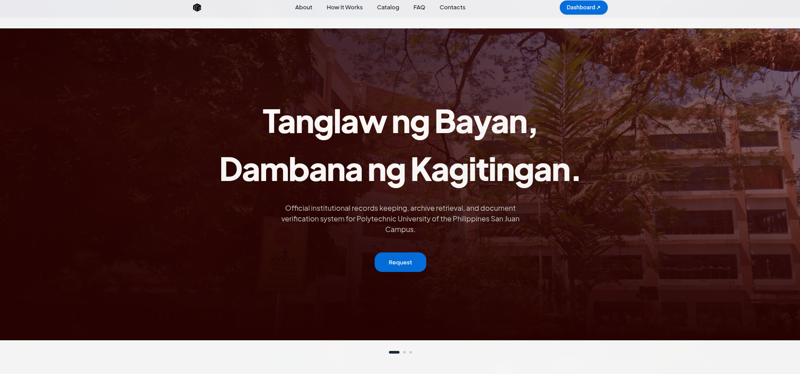

  

<h1 align="center">PUP eManage</h1>

<em>A Web-Based Records Keeping System (RKS) for Selected Offices in Polytechnic University of the Philippines, San Juan City Campus</em>

<strong>Web-based architecture. Automated OCR ingestion. Multi-office record keeping workflows.</strong>

---

<!-- Badges -->

  

    
    
    
    
    
  

  

    
    
    
    
    
  

---

  

## Overview

**PUP eManage** is a web-based Records Keeping System (RKS) developed for selected offices (Registrar, Office of Student Affairs and Services [OSAS], and Accounting) at the Polytechnic University of the Philippines, San Juan City Campus. It bridges physical paper archives and digital document operations—featuring automated OCR scanning ingestion, multi-office scoped workflows, interactive 2D physical archive drawer mapping, document verification, and cryptographic auditability.

The runnable Next.js application and its setup instructions are in [`next-app/`](next-app/). The current development setup is running locally using **PostgreSQL via Docker Compose** and the Next.js development server on `http://localhost:3000`.

## Tech Stack

### Architecture & Framework (Monolith)
- **Next.js 16 (App Router)** with **React 19** — Single full-stack monolithic framework handling both frontend UI and backend API routes on Node.js.

### Database
- **PostgreSQL 16** — Containerized via Docker Compose, queried via native `pg` driver.

### Notable Libraries & Packages
- **UI & Styling:** Tailwind CSS v4, shadcn/ui, Hugeicons, Phosphor Icons
- **Animation:** Framer Motion, GSAP
- **Auth & Security:** jose (JWT), speakeasy / otpauth (TOTP 2FA), qrcode, Node.js crypto (AES-256 PII/backup encryption)
- **Real-Time & System:** Socket.io, Chokidar (hot-folder scanner watcher)
- **OCR & Document Processing:** Tesseract OCR, wink-nlp (NLP normalization), pdfjs-dist, pdf-lib, jspdf, adm-zip
- **Analytics & Validation:** Recharts, Zod
- **Email & Feedback:** Nodemailer, Sonner

## Install or Run

- **macOS:** Follow the [one-click installer instructions](next-app/README.md#macos) in `next-app/installer/mac/`.
- **Windows:** Follow the [one-click installer instructions](next-app/README.md#windows) in `next-app/installer/windows/`.
- **Development:** Follow the [developer setup guide](next-app/README.md#developer-prerequisites).

For development and manual Docker Compose setup, use one environment file: `next-app/.env`, copied from `next-app/.env.example` (or `next-app/.env.sample`). See [Configure the environment](next-app/README.md#configure-the-environment) for the required settings.

## Core Capabilities

- **Automated Hot-Folder Ingestion & OCR:** Scans physical documents via flatbed or network scanners and extracts document fields locally using native OCR (Apple Vision / Windows OCR). Staff assigns each document to a student before filing.
- **Physical-to-Digital Mapping:** 2D interactive room, cabinet, and drawer layout tracking that links physical paper folders directly to digital records.
- **Role & Office Scoped Workflows:** Tailored document review and approval pipelines for the Registrar, Office of Student Affairs and Services (OSAS), and Accounting Office.
- **Security & Integrity:** Dual-token JWT session renewal, mandatory TOTP 2FA for administrative roles, cryptographic backup verification, and immutable audit logs.

## Developers

<table align="center">
  <tr>
    <td align="center" width="20%">
      <a href="https://github.com/icodecedd">
         
        <b>Cedrick Joseph Mariano</b>
      </a> 
      
    </td>
    <td align="center" width="20%">
      <a href="https://github.com/Harowwld">
         
        <b>Harold Prince dela Peña</b>
      </a> 
      
    </td>
    <td align="center" width="20%">
       
      <b>Joshue Poche</b> 
      
    </td>
    <td align="center" width="20%">
      <a href="https://github.com/paulomscln">
         
        <b>Paulo Masculino</b>
      </a> 
      
    </td>
    <td align="center" width="20%">
      <a href="https://github.com/rjjackflorida">
         
        <b>Rj Jack Florida</b>
      </a> 
      
    </td>
  </tr>
</table>

| Developer | Role | Focus Area |
|:---:|:---:|:---:|
| [**Cedrick Joseph Mariano**](https://github.com/icodecedd) | `Full Stack` | System Architecture, Authentication & Security |
| [**Harold Prince dela Peña**](https://github.com/Harowwld) | `Full Stack` | Database Architecture, Backend Repositories & Ingest |
| **Joshue Poche** | `Quality Assurance` | System Testing, Process Auditing & Quality Verification |
| [**Paulo Masculino**](https://github.com/paulomscln) | `Frontend` | UI/UX Design System, Dashboard Views & Component Polish |
| [**Rj Jack Florida**](https://github.com/rjjackflorida) | `Documentation` | Technical Writing, Operational Manuals & System Records |

## Project References

- [Agent and maintainer guide](AGENTS.md)
- [Component standards](COMPONENT_STANDARDS.md)
- [Architecture and operations documentation](docs/)
- `_SAMPLE_DATA/` — sample files and import fixtures
- `_LEGACY_PROTOTYPE/` — static prototype retained for reference

The app package manifest, dependencies, migrations, source, and deployment configuration live under `next-app/`.
